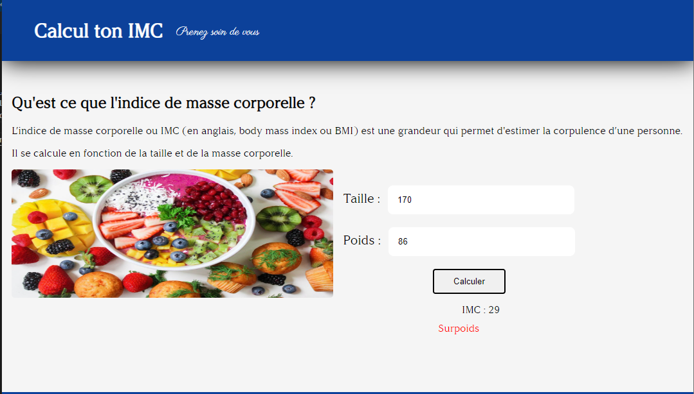

# Projet-imc

## Contexte :

Dans l'apprentissage du JavaScript, l'objectif était d'utiliser les dom, pour manipuler les différents éléments de ma page HTML.

Pour cela, j'ai coder un site web qui calcule L'imc d'une personne.

Dans le cas où une personne mesure 170cm et pèse 86Kg :

