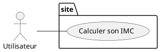
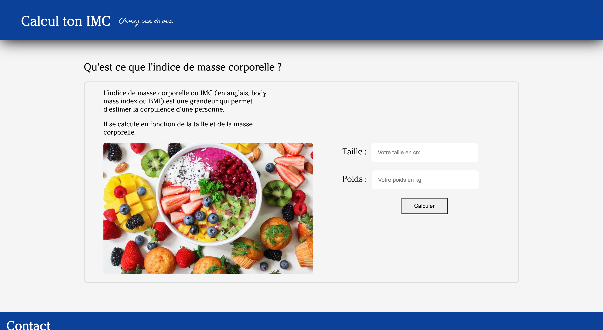
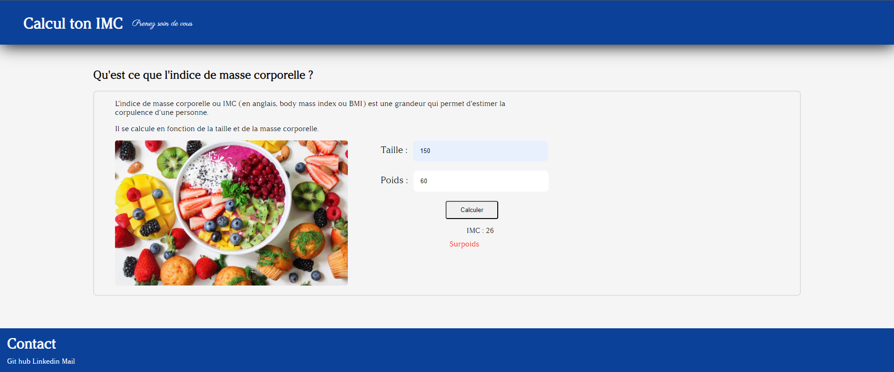
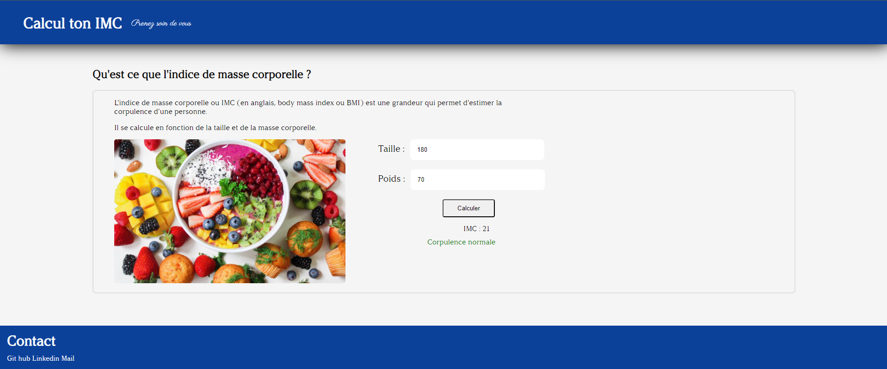

# Projet-imc

## Contexte :

Dans l'apprentissage du JavaScript, l'objectif était d'utiliser les dom, pour manipuler les différents éléments de ma page HTML.

Pour cela, j'ai codé un site web qui calcule L'imc d'une personne.

## Cas d'utilisation :

Dans le cas où une personne mesure 150 cm et pèse 60Kg :

Elle est en surpoids

Dans le cas où une personne mesure 180 cm et pèse 70Kg :

Elle a une corpulence normale.